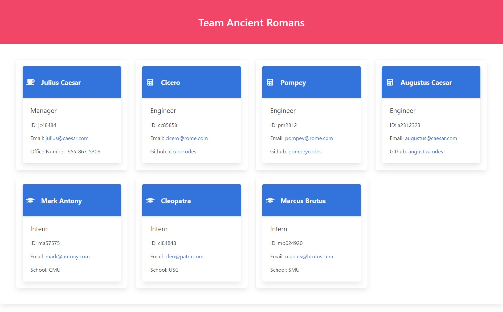

# Team Profile Generator

## Description 
This application prompts users for a project name, team members, and roles. It then generates html that renders a project team dashboard.
## Table of Contents
- [Installation](#installation)
- [Usage](#usage)
- [Screenshot](#screenshot)
- [Screencast](#screencast)
- [Tests](#tests)
- [Questions](#questions)
- [Credit](#Credit)
## Installation
To install the necessary dependencies run:
```
npm i
```
## Usage
```
To use type node index.js from the command line.
```
## Screenshot

## Screencast
[Screencast Link](https://drive.google.com/file/d/1YCJ1i2q74DBz6jKInljygnVh3mjX5vCH/view?usp=sharing)
## Tests
```
To run tests on this application type "npm run test" from the command line.
```
## Questions
```
If you have questions about the repo, open an issue or contact me at 
cstuhlfire@gmail.com. You can find this project along with my other work 
at https://github.com/cstuhlfire.
```

